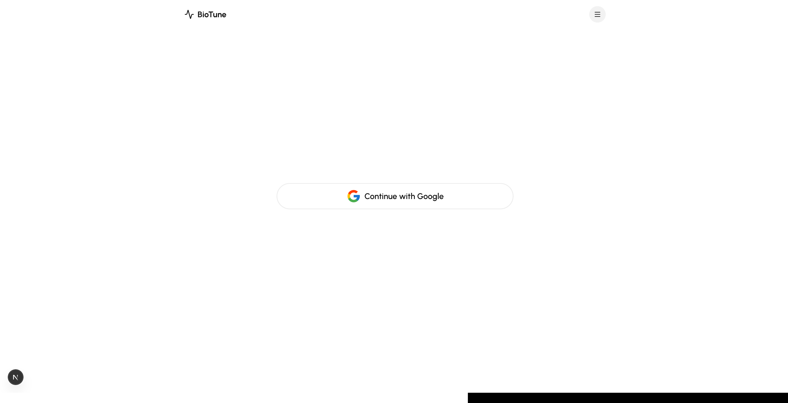
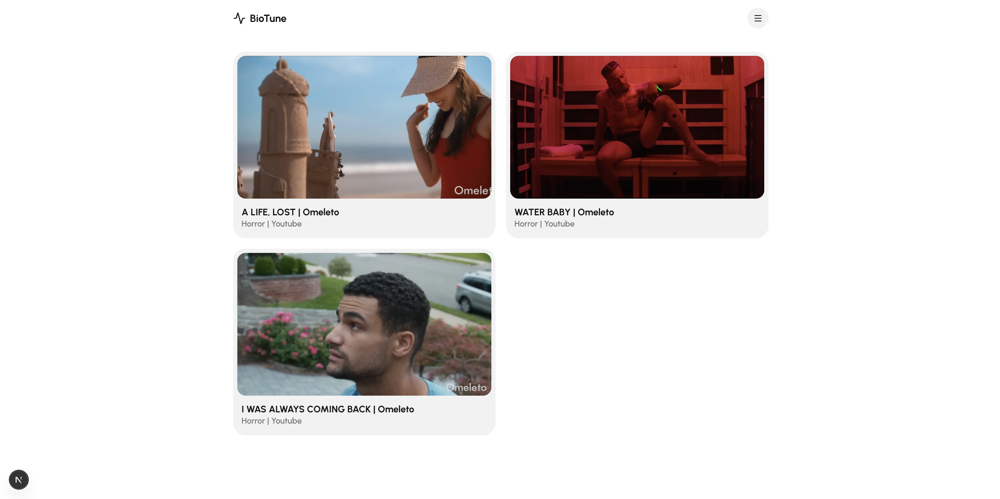
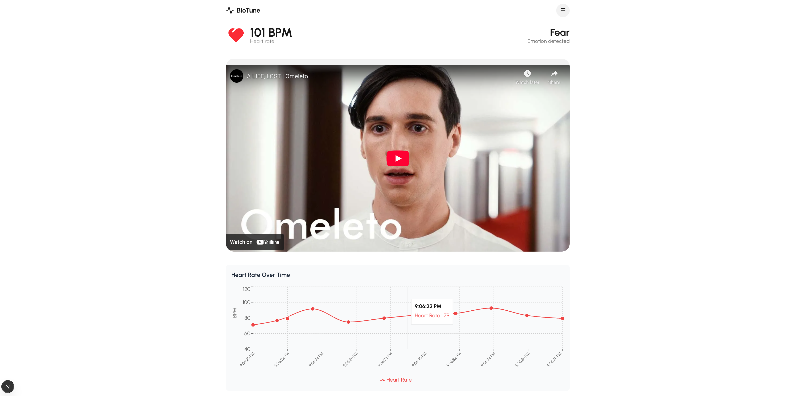

#**BioTune**- The next innovation in entertainment analysis
**==================================================================================================================================**

## Introduction: 
**---------------------------------------------------------------------------------------------------------------------------------**
### Our tool, BioTune, allows users to watch different forms of media and track their beats per minute live. This is possible with a heart rate tracker. Additionally, with the use of the Gemini API we are able to compute different emotions based on bpm variations and spikes. A built in dashboard will present the emotion data afterwards. How can you see what you watched before? A history feature that allows you to relive those emotions. In short, we've helped viewers (and studios) pinpoit what sparks the best reactions!

## Built With:
**---------------------------------------------------------------------------------------------------------------------------------**
<p>
  <a href="https://nextjs.org/">
    
  </a>
  <a href="https://react.dev/">
    
  </a>
  <a href="https://www.typescriptlang.org/">
    
  </a>
  <a href="https://tailwindcss.com/">
    
  </a>
  <a href="https://www.chartjs.org/">
    
  </a>
  <a href="https://sheetjs.com/">
    
  </a>
  <a href="https://firebase.google.com/">
    
  </a>
  <a href="https://vercel.com/">
    
  </a>
  <a href="https://openai.com/">
    
  </a>
  <a href="https://aistudio.google.com/">
    
  </a>
</p>

## Features:
**---------------------------------------------------------------------------------------------------------------------------------**
### Login Page


### Home Page


### Video Page


## How to Build This Yourself
**---------------------------------------------------------------------------------------------------------------------------------**

### Before you start:
- **Node.js** 18+ and npm installed
- **Firebase** account (free tier works!)
- **Google Gemini API** key ([Get it free](https://aistudio.google.com/app/apikey))
- **Heart rate sensor** (optional - can simulate data)
- Basic knowledge of React and Next.js

### Installation:
```bash
git clone https://github.com/bnakusaki1/mhl-ai-atl.git
cd mhl-ai-atl
npm install
```

## Configure

Create `.env.local`:
```bash
NEXT_PUBLIC_FIREBASE_API_KEY=your_key
NEXT_PUBLIC_FIREBASE_PROJECT_ID=your_project
GEMINI_API_KEY=your_gemini_key
```

Get keys: [Firebase](https://console.firebase.google.com) | [Gemini](https://aistudio.google.com/app/apikey)

## Run
```bash
npm run dev
# Open http://localhost:3000
```

## How It Works
```
BPM → AI Analysis (every 10s) → Emotion → Firebase
```

## Stack

Next.js • Firebase • Gemini AI • Framer Motion

---

**Build time: 2 hours** | [Full Docs](#)

## Top Contributors

<a href="https://github.com/bnakusaki1/mhl-ai-atl/graphs/contributors">
  
</a>

## Full Team - Benjamin Nakusaki, Jaeyoung Choi, Jalani Bandele, Jason Nguyen
